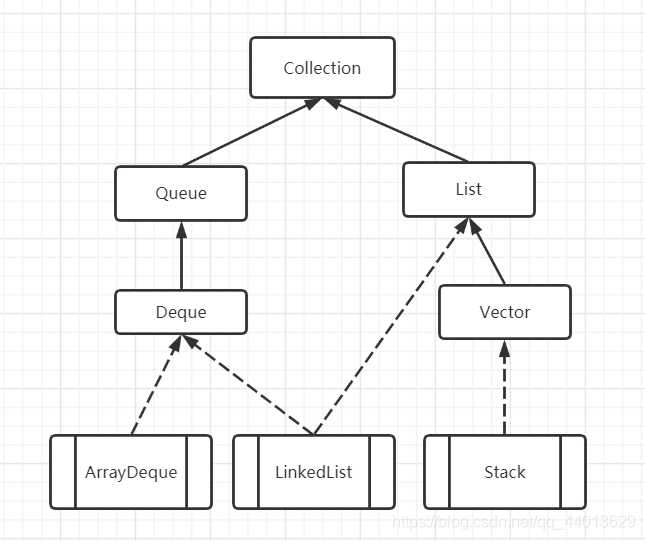

# 树的遍历

#### 迭代法·套路模板：

使用stack控制TreeNode节点

* 根：`res.add(node.val)`  
* 左：`node = node.left`
* 右：`node = node.right`
* 控制出栈入栈：
  * `stack.push(node.val)`
  * `stack.pop()`

整体代码逻辑

```java
//省略号(...)为“根”可能出现的位置
while(!stack.isEmpty() || node != null){
    if(node != null){
        //根：根据遍历顺序调整
        res.add(node.val)
        ...
        stack.push(node.val);
        //左子树
        node = node.left;
    }
    else{
    	stack.pop();
        ...
        //右子树
        node = node.right;
    }
}
```

[前序遍历套路](1. 二叉树的前序遍历.md)

[中序遍历套路](2. 二叉树的中序遍历.md)

[后序遍历套路](3. 二叉树的后序遍历.md)

# 栈(stack)的使用



**不建议**使用stack：效率低，synchronize的问题

Stack：上进上出
Deque：上进上出，上进下出，甚至下进上出

### 1. 栈(stack)的一般初始化

`Deque<TreeNode> stack = new LinkedList<>();`

### 2. ArrayDeque和LinkedList区别

**ArrayDeque:**

* 数组结构
* 插入元素不能为null
* 无法确定容量时，后期扩容收到影响

**LinkedList**

* 链表结构
* 插入元素可以为null
* 无法确定数据容量，有更好表现

### 3. Deque中的常用方法

#### 3.1 Deque当做·栈·使用

|   操作   |                          函数                           |
| :------: | :-----------------------------------------------------: |
|   入栈   |                        push(E e)                        |
|   出栈   | poll() / pop() 后者在栈空的时候会抛出异常，前者返回null |
| 查看栈顶 |                  peek() 为空时返回null                  |

#### 3.2 Deque当做·队列·使用

|   操作   |         函数          |
| :------: | :-------------------: |
|   入队   |      offer(E e)       |
|   出队   | poll() 为空时返回null |
| 查看队首 | peek() 为空时返回null |

--- · 进阶操作 · ---

#### 3.3 从上方/头部·插入

| **方法名**              |                             作用                             |
| ----------------------- | :----------------------------------------------------------: |
| void addFirst(E e)      |      将指定的元素插入此双端队列的前面 ，空间不足抛异常       |
| boolean offerFirst(E e) | 将指定的元素插入此双端队列的前面 ，空间不足插入失败**返回false** |
| void push(E e)          |      将指定的元素插入此双端队列的前面 ，空间不足抛异常       |

#### 3.4 从上方/头部·删除/观察

|   **方法名**    |                         **作用**                          |
| :-------------: | :-------------------------------------------------------: |
| E removeFirst() |           检索并删除第一个元素，为空时抛出异常            |
|   E remove()    |  和removeFirst一样 检索并删除第一个元素，为空时抛出异常   |
|     E pop()     |  和removeFirst一样 检索并删除第一个元素，为空时抛出异常   |
|  E pollFirst()  |           检索并删除第一个元素 ，为空时返回null           |
|    E poll()     |   和pollFirst一样 检索并删除第一个元素 ，为空时返回null   |
|  E getFirst()   |          只看看第一个元素 ，不出来，为空就抛异常          |
|   E element()   |  和getFirst一样 只看看第一个元素 ，不出来，为空就抛异常   |
|  E peekFirst()  |         只看看第一个元素 ，不出来，为空时返回null         |
|    E peek()     | 和peekFirst一样 只看看第一个元素 ，不出来，为空时返回null |

#### 3.5 从下方/尾部·插入

|       **方法名**       |                      **作用**                       |
| :--------------------: | :-------------------------------------------------: |
|   void addLast(E e)    |       检索并删除最后一个元素，为空时抛出异常        |
| boolean offerLast(E e) | 将指定的元素插入此双端队列的后面，空间不足返回false |
|    boolean add(E e)    |  将指定的元素插入此双端队列的后面，空间不足抛异常   |
|   boolean offer(E e)   | 将指定的元素插入此双端队列的后面，空间不足返回false |

#### 3.6 从下方/尾部·删除/观察

|   **方法名**   |                  **作用**                   |      |
| :------------: | :-----------------------------------------: | ---- |
| E removeLast() |   检索并删除最后一个元素，为空时抛出异常    |      |
|  E pollLast()  |   检索并删除最后一个元素 ，为空时返回null   |      |
|  E getLast()   |  只看看最后一个元素 ，不出来，为空就抛异常  |      |
|  E peekLast()  | 只看看最后一个元素 ，不出来，为空时返回null |      |


